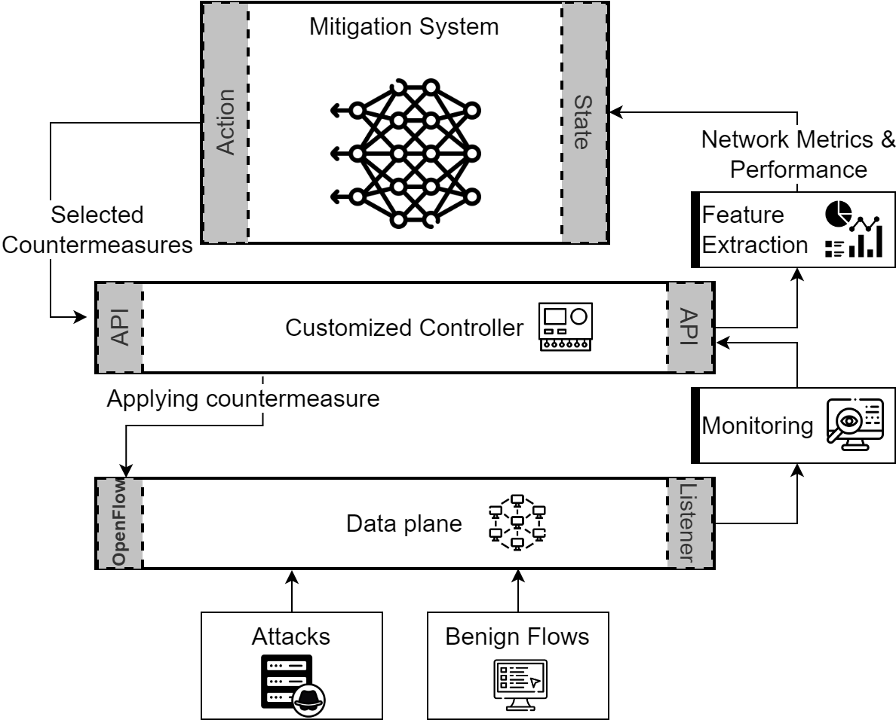

# SMART: Scalable Mitigation Architecture using Reinforcement learning for DDoS Attack Traffic in SDN Environments

## Introduction

The proliferation of Internet of Things (IoT) devices within 5G networks has significantly expanded the attack surface for Distributed Denial-of-Service (DDoS) attacks. Due to their limited security capabilities, IoT devices are attractive targets for compromise, enabling adversaries to launch large-scale, high-volume flooding attacks. In Software-Defined Networking (SDN)-based infrastructures, such attacks exploit dynamic, flow-based mechanisms, overwhelming flow tables and congesting forwarding paths. Traditional mitigation strategies struggle to respond to these evolving threats in real-time and typically introduce high latency, making them unsuitable for the performance requirements of modern networks. In this paper, we propose a scalable and generalizable DDoS mitigation framework based on Double Deep Q-Network (DDQN) reinforcement learning, designed to counter a wide range of flooding-based attacks across multiple protocol layers while preserving Quality of Service (QoS) for legitimate users. Our approach introduces a group-based state projection mechanism to reduce input dimensionality, thereby minimizing computational overhead without sacrificing essential network insights. To ensure adaptability across diverse network topologies, we employ modular neural architectures with permutation-invariant and permutation-equivariant functions, enabling the model to generalize across varying network sizes and entry point configurations without retraining. Experimental evaluations in an emulated SDN environment demonstrate the framework’s robustness, scalability, and efficiency in maintaining service availability for legitimate users.

## Table of contents

- [SMART: Scalable Mitigation Architecture using Reinforcement learning for DDoS Attack Traffic in SDN Environments](#smart-scalable-mitigation-architecture-using-reinforcement-learning-for-ddos-attack-traffic-in-sdn-environments)
  * [Introduction](#introduction)
  * [Table of contents](#table-of-contents)
  * [System Architecture](#system-architecture)
  * [Pseudo code](#pseudo-code)
  * [Modules](#modules)
    + [Mininet Network](#mininet-network)
    + [Reinforcement Learning](#reinforcement-learning)
    + [Tools - Hosts Topology Generator](#tools---hosts-topology-generator)
  * [Requirements](#requirements)
  * [License](#license)
  * [Acknowledgments](#acknowledgments)

## System Architecture



## Pseudo code

```plaintext
BEGIN
  Initialize the Mininet environment with the specified network topology
  Set up the Double Deep Q-Network (DDQN)
  FOR each episode in the training sessions:
    Reset the network to the initial state
    WHILE the network is active:
      Observe the current state of the network
      Select an action based on the current state using the DDQN model
      Execute the selected action in the Mininet environment
      Observe the new state and reward from the network
      Update the DDQN model with the new state and reward
    END WHILE
  END FOR
  Evaluate the performance of the trained model
END
```

## Modules

### Mininet Network
A Mininet-based network topology with an exposed Flask API.

For more details, refer to the corresponding [README.md](network/README.md) file.

### Reinforcement Learning
A whole simulation and training process that depends on the Network module.

For more details, refer to the corresponding [README.md](reinforcement/README.md) file.

### Tools - Hosts Topology Generator
A python script to generate a JSON topology file for hosts.

For more details, refer to the corresponding [README.md](tools/hoststopo/README.md) file.

## Requirements

To be able to run the project, you should have:

- **Ubuntu 20.04 LTS**:
  - Running as a main system or inside a VM.
- **Python v3.8**:
  - Requirements at [requirements.txt](requirements.txt).
- **Mininet v2.2.2**:
  - From [Mininet official website](https://mininet.org/download/).
- **Apache Maven 3.6.3**.
- **Gradle v4.4.1**.
- **JDK v1.8**:
  - Tested with Openjdk V 1.8.0_422.
- **CICFlowMeter v4.0**:
  - From [CICFlowMeter Github Repository](https://github.com/CanadianInstituteForCybersecurity/CICFlowMeter).
- **MHDDoS v2.4.1**:
  - From [MHDDoS Github Repository](https://github.com/MatrixTM/MHDDoS).
- **TShark 3.2.3**:
  - Git v3.2.3 packaged as 3.2.3-1.

## License

This project is licensed under the GNU License - see the [LICENSE.md](LICENSE) file for details.

## Acknowledgments

- Thanks to the contributors and maintainers of the Mininet, MHDDoS, and CICFlowMeter projects.
- Special thanks to the team and advisors who provided insights and expertise that greatly assisted the research.
- Gratitude to all who provided feedback and suggestions that improved this project.